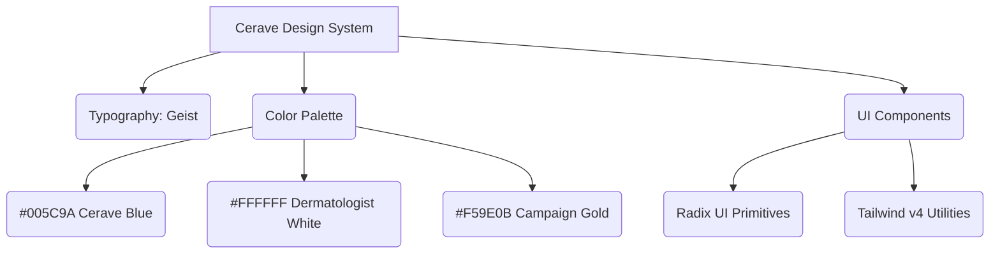

## DESIGN SYSTEM & VISUAL TOKEN ARCHITECTURE

**Cerave Cera-Awards Design System**

> [!NOTE]
> **Design System Overview:** This design system outlines the visual language, typography, and core components used across the Cera-Awards campaign platform. It translates Cerave's dermatologist-recommended brand identity into a digital interface, prioritizing clinical cleanliness, high accessibility, and engaging interactions for the voting experience.

### 🎨 Brand Color Tokens

**Primary Palette**
* **Dermatologist White** (`#FFFFFF`): Main background for cards, modals, and the global application. Promotes a clean, clinical aesthetic.
* **Clinical Slate** (`#F4F6F8`): Secondary background for active states, hover effects, and section dividers. Reduces eye strain while maintaining a sterile look.
* **Obsidian Navy** (`#0F172A`): Primary text color and top navigation bars. Offers higher readability than pure black.

**Accents & Highlights**
* **Cerave Medical Blue** (`#005C9A`): Primary calls-to-action, active navigation links, and active voting states. The core brand identifier.
* **Success Emerald** (`#10B981`): Used for successful vote casting, form validation, and positive toast notifications (`sonner`).
* **Campaign Gold** (`#F59E0B`): Used exclusively for highlighting award categories, trophy icons, and top-ranking nominees in the Recharts data visualization.

### 🖋 Typography Architecture (Geist)

**Font Family:** `Geist`, sans-serif (Served via `next/font`)
*Clean, engineered, highly legible geometric sans-serif tailored for modern digital displays.*

**Weight Hierarchy**
* **Regular (400):** Standard Body Text & Descriptions.
* **Medium (500):** Navigation Links & Input Labels.
* **Semi-Bold (600):** Section Headers & Nominee Names.
* **Bold (700):** Primary CTAs & Category Titles.

**Sizing Scale (Tailwind Tokens)**
* **Small / Micro:** `text-[10px]` — `text-xs` (Labels, vote counts, uppercase meta info)
* **Body Reading:** `text-sm` — `text-base` (Standard reading content and nominee biographies)
* **Headings:** `text-2xl` — `text-4xl` (Page titles, hero sections & award categories)

### 📐 UI Components & Styling Tokens

**1. Clinical Frost (Overlays)**
Floating panels and modals utilize subtle frosted glass to maintain context without overwhelming the user during the OTP voting flow:
* **Backdrops:** `bg-white/90 backdrop-blur-md`
* **Dark Overlays (Modals):** `bg-[#0F172A]/40 backdrop-blur-sm`

**2. Approachable Radii (Corner Language)**
A mix of pill-shaped buttons and soft-rounded containers to make the clinical brand feel friendly and approachable:
* **Buttons & Pills:** `rounded-full` (for primary voting actions)
* **Cards & Modals:** `rounded-2xl` (for nominee cards)
* **Photos Frame:** `rounded-xl` (for product/nominee images)

**3. Accessible Shadows (Elevation)**
Soft, dispersed, cool-tinted shadows to prevent harsh contrast and maintain the light aesthetic:
* **Cards:** `shadow-sm shadow-blue-900/5`
* **CTA Glow:** `shadow-lg shadow-[#005C9A]/20`
* **Overlays:** `shadow-2xl`

**4. Trust-Building Micro-animations**
Interactive elements feel responsive, confirming user actions instantly to build trust during the voting process:
* **CTAs:** `transition-all duration-300 active:scale-95`
* **Nominee Cards:** `group-hover:border-[#005C9A]/50 group-hover:-translate-y-1`

### 📱 Accessibility & Interaction Engine

**Dynamic Contrast & Scalability**
* **Focus States:** High-visibility focus rings (`focus-visible:ring-2 focus-visible:ring-[#005C9A] focus-visible:ring-offset-2`) implemented globally via Radix UI primitives.
* **ARIA Compliance:** All interactive elements (`react-accordion`, `react-dialog`) are inherently accessible for screen readers, ensuring everyone can participate in the Cera-Awards.

### 📊 System Component Architecture

